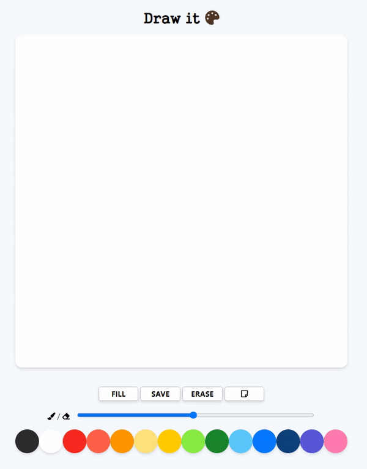

# paintjs

##### Painting Board made with VanillaJS

- 색, 브러쉬 크기조정 기능을 이용해서 그림 그리기.
- FILL/PAINT 버튼으로 그림모드를 지정 가능.
- ERASE 버튼 - 그림 지우기.
- 종이 버튼 - 그림을 새로 그리기.
- SAVE 버튼 - 클릭하면 그린 그림을 저장.

## 🛠 Tech Stack

  

## 🗂 Structure

```bash
app.js
│
index.html
│
reset.css
│
style.css

```

## 👀



https://kimkyungmin123.github.io/paintjs/
